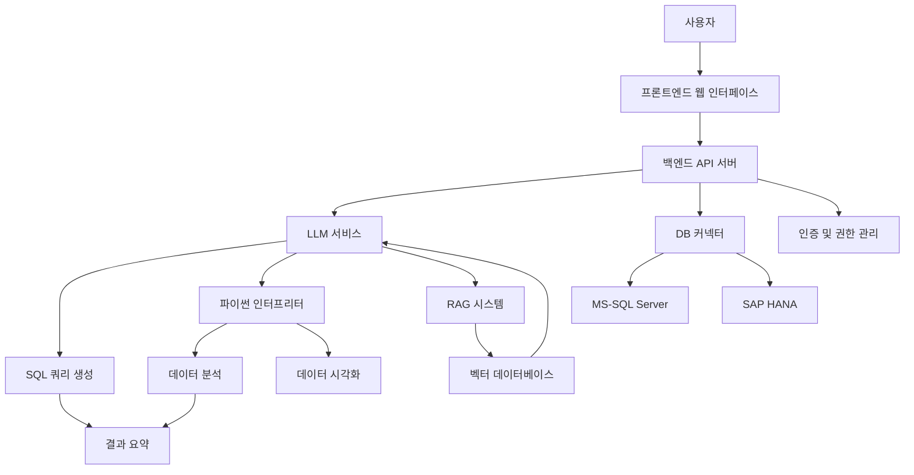

# Design Document: SQL DB LLM Agent System

## Overview

SQL DB LLM Agent 시스템은 비기술적 사용자가 자연어로 데이터베이스에 질의하고 결과를 다양한 형식으로 확인할 수 있는 웹 기반 서비스입니다. 이 시스템은 LLM(Large Language Model)을 활용하여 자연어를 SQL로 변환하고, RAG(Retrieval-Augmented Generation) 시스템을 통해 키워드 기반 검색을 지원하며, 파이썬 인터프리터를 통해 고급 데이터 분석 및 시각화 기능을 제공합니다.

## Architecture

시스템은 다음과 같은 주요 구성 요소로 이루어집니다:



### 주요 구성 요소 설명:

1. **프론트엔드 웹 인터페이스**: 사용자 인증, 질의 입력, 결과 표시, 이력 관리 등의 UI 제공
2. **백엔드 API 서버**: 모든 요청 처리 및 시스템 구성 요소 조정
3. **인증 및 권한 관리**: 사용자 인증, 세션 관리, DB 접근 권한 제어
4. **LLM 서비스**: 자연어-SQL 변환, 결과 요약, 대화 컨텍스트 관리
5. **RAG 시스템**: 키워드 기반 검색, 관련 데이터 검색 및 응답 생성
6. **DB 커넥터**: 다양한 DB 연결 관리, 쿼리 실행, 결과 처리
7. **파이썬 인터프리터**: 데이터 분석, 시각화, 리포트 생성
8. **벡터 데이터베이스**: RAG 시스템을 위한 텍스트 임베딩 저장 및 검색

## Components and Interfaces

### 1. 프론트엔드 컴포넌트

#### 1.1 사용자 인터페이스 모듈

- **로그인 화면**: 사용자 인증 폼 제공
- **대시보드**: DB 선택, 질의 입력, 결과 표시 영역 제공
- **이력 관리**: 이전 쿼리 및 결과 조회, 필터링, 공유 기능
- **관리자 콘솔**: 시스템 모니터링, 사용자 관리, 정책 설정 기능

#### 1.2 상태 관리

- **사용자 세션**: 로그인 상태, 권한 정보, 선택된 DB 정보 관리
- **쿼리 상태**: 쿼리 실행 상태, 진행률, 결과 캐싱
- **오류 처리**: 사용자 친화적 오류 메시지 표시 및 해결 방법 제안

#### 1.3 API 클라이언트

- **인증 API**: 로그인, 로그아웃, 세션 갱신
- **DB API**: DB 목록 조회, 연결, 스키마 정보 조회
- **쿼리 API**: 자연어 질의 전송, SQL 확인, 쿼리 실행, 결과 수신
- **이력 API**: 쿼리 이력 조회, 공유, 재실행

### 2. 백엔드 API 서버

#### 2.1 API 엔드포인트

- **인증 API**: `/api/auth/login`, `/api/auth/logout`, `/api/auth/refresh`
- **DB API**: `/api/db/list`, `/api/db/connect`, `/api/db/schema`
- **쿼리 API**: `/api/query/natural`, `/api/query/sql`, `/api/query/execute`, `/api/query/cancel`
- **결과 API**: `/api/result/summary`, `/api/result/report`, `/api/result/download`
- **이력 API**: `/api/history/list`, `/api/history/get`, `/api/history/share`
- **관리자 API**: `/api/admin/users`, `/api/admin/policies`, `/api/admin/logs`

#### 2.2 미들웨어

- **인증 미들웨어**: 요청 인증 검증, 세션 관리
- **권한 미들웨어**: 사용자 권한 검증, 접근 제어
- **로깅 미들웨어**: 요청 및 응답 로깅, 감사 추적
- **오류 처리 미들웨어**: 예외 처리, 오류 응답 생성

#### 2.3 서비스 레이어

- **인증 서비스**: 사용자 인증, 세션 관리
- **DB 연결 서비스**: DB 연결 풀 관리, 연결 상태 모니터링
- **쿼리 처리 서비스**: 자연어 질의 처리, SQL 생성, 쿼리 실행
- **결과 처리 서비스**: 결과 포맷팅, 페이지네이션, 요약 생성
- **이력 관리 서비스**: 쿼리 이력 저장, 조회, 공유
- **관리자 서비스**: 사용자 관리, 정책 설정, 시스템 모니터링

### 3. LLM 서비스

#### 3.1 LLM 인터페이스

- **프롬프트 생성**: DB 스키마 정보를 포함한 프롬프트 생성
- **LLM 호출**: OpenAI, Azure OpenAI, Hugging Face 등 LLM API 호출
- **응답 처리**: LLM 응답 파싱, SQL 추출, 오류 처리

#### 3.2 자연어-SQL 변환

- **컨텍스트 관리**: 대화 이력 및 컨텍스트 유지
- **스키마 통합**: DB 스키마 정보를 프롬프트에 통합
- **SQL 검증**: 생성된 SQL의 문법 및 안전성 검증
- **SQL 최적화**: 성능을 위한 SQL 쿼리 최적화

#### 3.3 결과 요약

- **데이터 분석**: 쿼리 결과 데이터 분석
- **인사이트 추출**: 주요 패턴, 이상치, 추세 식별
- **자연어 요약**: 분석 결과의 자연어 요약 생성

### 4. RAG 시스템

#### 4.1 문서 인덱싱

- **데이터 수집**: DB 스키마, 테이블 설명, 필드 설명 등 수집
- **텍스트 처리**: 토큰화, 정규화, 불용어 제거
- **임베딩 생성**: 텍스트 임베딩 생성 및 저장

#### 4.2 검색 엔진

- **키워드 검색**: 키워드 기반 관련 문서 검색
- **의미 검색**: 임베딩 유사도 기반 관련 문서 검색
- **하이브리드 검색**: 키워드 및 의미 검색 결과 통합

#### 4.3 응답 생성

- **컨텍스트 구성**: 검색 결과를 기반으로 컨텍스트 구성
- **LLM 응답 생성**: 컨텍스트와 질의를 기반으로 응답 생성
- **소스 인용**: 응답에 사용된 정보 소스 인용

### 5. DB 커넥터

#### 5.1 연결 관리

- **연결 풀**: DB 연결 풀 관리, 연결 재사용
- **인증 관리**: DB 인증 정보 안전한 관리
- **상태 모니터링**: 연결 상태 모니터링, 장애 감지

#### 5.2 쿼리 실행

- **쿼리 전처리**: 쿼리 파라미터화, 인젝션 방지
- **실행 제어**: 타임아웃 설정, 취소 기능
- **결과 스트리밍**: 대용량 결과의 효율적 처리

#### 5.3 DB 어댑터

- **MS-SQL 어댑터**: MS-SQL Server 연결 및 쿼리 실행
- **SAP HANA 어댑터**: SAP HANA 연결 및 쿼리 실행
- **방언 처리**: DB별 SQL 문법 차이 처리

### 6. 파이썬 인터프리터

#### 6.1 실행 환경

- **로컬 파이썬 실행**: 서버 내에서 직접 파이썬 코드 실행 (샌드박스 없음)
- **라이브러리 관리**: pandas, matplotlib 등 필요 라이브러리 관리
- **기본 제한**: 실행 시간 제한 및 취소 기능 구현

#### 6.2 데이터 분석

- **데이터 로딩**: 쿼리 결과 데이터 로딩
- **데이터 처리**: 정제, 변환, 집계, 분석
- **통계 분석**: 기술 통계, 상관 분석, 시계열 분석 등

#### 6.3 시각화

- **차트 생성**: 다양한 유형의 차트 및 그래프 생성
- **인터랙티브 시각화**: 필요시 인터랙티브 시각화 요소 추가
- **리포트 생성**: 분석 결과와 시각화를 포함한 리포트 생성

## Data Models

### 1. 사용자 모델

```typescript
interface User {
  id: string;
  username: string;
  passwordHash: string;
  email: string;
  role: "user" | "admin";
  lastLogin: Date;
  createdAt: Date;
  updatedAt: Date;
  preferences: UserPreferences;
  permissions: UserPermissions;
}

interface UserPreferences {
  defaultDb?: string;
  theme: "light" | "dark";
  resultsPerPage: number;
}

interface UserPermissions {
  allowedDatabases: DatabasePermission[];
}

interface DatabasePermission {
  dbId: string;
  dbType: "mssql" | "hana";
  allowedSchemas: string[];
  allowedTables: string[];
}
```

### 2. 데이터베이스 모델

```typescript
interface Database {
  id: string;
  name: string;
  type: "mssql" | "hana";
  host: string;
  port: number;
  defaultSchema: string;
  connectionConfig: ConnectionConfig;
  createdAt: Date;
  updatedAt: Date;
}

interface ConnectionConfig {
  username: string;
  passwordEncrypted: string;
  options: Record<string, any>;
}

interface DatabaseSchema {
  dbId: string;
  schemas: Schema[];
  lastUpdated: Date;
}

interface Schema {
  name: string;
  tables: Table[];
}

interface Table {
  name: string;
  columns: Column[];
  primaryKey: string[];
  foreignKeys: ForeignKey[];
  description?: string;
}

interface Column {
  name: string;
  type: string;
  nullable: boolean;
  defaultValue?: any;
  description?: string;
}

interface ForeignKey {
  columns: string[];
  referenceTable: string;
  referenceColumns: string[];
}
```

### 3. 쿼리 및 결과 모델

```typescript
interface Query {
  id: string;
  userId: string;
  dbId: string;
  naturalLanguage: string;
  generatedSql: string;
  executedSql?: string;
  status: "pending" | "executing" | "completed" | "failed" | "cancelled";
  startTime: Date;
  endTime?: Date;
  error?: string;
  resultId?: string;
  createdAt: Date;
}

interface QueryResult {
  id: string;
  queryId: string;
  columns: ResultColumn[];
  rows: any[][];
  rowCount: number;
  truncated: boolean;
  totalRowCount?: number;
  summary?: string;
  reportId?: string;
  createdAt: Date;
}

interface ResultColumn {
  name: string;
  type: string;
}

interface Report {
  id: string;
  resultId: string;
  pythonCode: string;
  visualizations: Visualization[];
  insights: string[];
  createdAt: Date;
}

interface Visualization {
  id: string;
  type: "bar" | "line" | "pie" | "scatter" | "heatmap" | "custom";
  title: string;
  description?: string;
  imageData: string; // Base64 encoded image
}
```

### 4. 이력 및 공유 모델

```typescript
interface QueryHistory {
  id: string;
  userId: string;
  queryId: string;
  favorite: boolean;
  tags: string[];
  notes?: string;
  createdAt: Date;
  updatedAt: Date;
}

interface SharedQuery {
  id: string;
  queryId: string;
  sharedBy: string;
  accessToken: string;
  expiresAt?: Date;
  allowedUsers?: string[];
  createdAt: Date;
}
```

### 5. 관리자 모델

```typescript
interface SystemPolicy {
  id: string;
  name: string;
  description: string;
  settings: PolicySettings;
  createdAt: Date;
  updatedAt: Date;
}

interface PolicySettings {
  maxQueriesPerDay: number;
  maxQueryExecutionTime: number;
  maxResultSize: number;
  allowedQueryTypes: string[];
  blockedKeywords: string[];
}

interface SystemLog {
  id: string;
  timestamp: Date;
  level: "info" | "warning" | "error" | "critical";
  category: "auth" | "query" | "system" | "security";
  message: string;
  userId?: string;
  details: Record<string, any>;
}
```

## Error Handling

### 1. 오류 유형 및 처리 전략

#### 1.1 인증 및 권한 오류

- **인증 실패**: 잘못된 인증 정보, 만료된 세션
  - 처리: 로그인 페이지로 리디렉션, 명확한 오류 메시지 제공
- **권한 부족**: 접근 권한 없는 DB 또는 테이블
  - 처리: 접근 거부 메시지, 필요한 권한 안내

#### 1.2 DB 연결 오류

- **연결 실패**: 네트워크 문제, 인증 실패, DB 서버 다운
  - 처리: 구체적 오류 원인 진단, 연결 재시도 옵션 제공
- **타임아웃**: 연결 또는 쿼리 타임아웃
  - 처리: 타임아웃 알림, 재시도 또는 쿼리 최적화 제안

#### 1.3 쿼리 오류

- **SQL 변환 오류**: 자연어를 SQL로 변환 실패
  - 처리: 변환 실패 원인 설명, 질의 명확화 요청
- **SQL 실행 오류**: 문법 오류, 존재하지 않는 테이블/필드
  - 처리: 오류 위치 강조, 수정 제안

#### 1.4 LLM 서비스 오류

- **API 오류**: LLM API 호출 실패, 할당량 초과
  - 처리: 대체 LLM으로 전환, 기본 SQL 편집기 모드 제공
- **부적절한 응답**: 잘못된 SQL 생성, 관련 없는 응답
  - 처리: 응답 검증, 재시도, 사용자 피드백 요청

#### 1.5 시스템 오류

- **리소스 부족**: 메모리 부족, CPU 과부하
  - 처리: 리소스 확보를 위한 작업 큐잉, 사용자에게 지연 알림
- **내부 오류**: 예상치 못한 시스템 오류
  - 처리: 오류 로깅, 관리자 알림, 사용자에게 일반 오류 메시지

### 2. 오류 응답 형식

```typescript
interface ErrorResponse {
  status: "error";
  code: string;
  message: string;
  details?: any;
  suggestions?: string[];
  retryable: boolean;
}
```

### 3. 오류 로깅 및 모니터링

- **구조화된 로깅**: 오류 유형, 시간, 사용자, 컨텍스트 정보 포함
- **심각도 수준**: info, warning, error, critical 등 심각도 분류
- **알림 시스템**: 중요 오류 발생 시 관리자에게 즉시 알림
- **패턴 감지**: 반복 발생 오류 패턴 감지 및 근본 원인 분석

## Testing Strategy

### 1. 단위 테스트

- **대상**: 개별 함수, 클래스, 컴포넌트
- **도구**: Jest, Mocha, PyTest 등
- **접근 방식**:
  - 입력-출력 테스트
  - 경계값 테스트
  - 예외 처리 테스트
- **모킹**: 외부 의존성(DB, LLM API 등) 모킹

### 2. 통합 테스트

- **대상**: 여러 컴포넌트 간 상호작용
- **도구**: Supertest, TestContainers 등
- **접근 방식**:
  - API 엔드포인트 테스트
  - 서비스 간 통합 테스트
  - DB 연동 테스트
- **환경**: 테스트용 DB, 모의 LLM 서비스

### 3. 엔드투엔드 테스트

- **대상**: 전체 시스템 흐름
- **도구**: Cypress, Selenium 등
- **접근 방식**:
  - 사용자 시나리오 기반 테스트
  - UI 상호작용 테스트
  - 성능 및 부하 테스트
- **환경**: 스테이징 환경, 테스트 데이터셋

### 4. 보안 테스트

- **대상**: 인증, 권한, 데이터 보호
- **도구**: OWASP ZAP, SonarQube 등
- **접근 방식**:
  - 취약점 스캔
  - 침투 테스트
  - SQL 인젝션 테스트
- **주기**: 주요 릴리스 전, 정기적 보안 감사

### 5. 성능 테스트

- **대상**: 응답 시간, 처리량, 리소스 사용
- **도구**: JMeter, Locust 등
- **접근 방식**:
  - 부하 테스트
  - 스트레스 테스트
  - 확장성 테스트
- **지표**: 응답 시간, 처리량, 오류율, 리소스 사용률

## Security Considerations

### 1. 인증 및 접근 제어

- **다중 인증(MFA)**: 선택적 MFA 지원
- **세션 관리**: 안전한 세션 생성, 저장, 만료 처리
- **최소 권한 원칙**: 사용자별 필요 최소한의 권한만 부여
- **역할 기반 접근 제어**: 사용자 역할에 따른 기능 접근 제어

### 2. 데이터 보호

- **저장 데이터 암호화**: DB 인증 정보, 민감 데이터 암호화(AES-256)
- **전송 데이터 암호화**: TLS 1.3 사용
- **데이터 마스킹**: 필요시 민감 정보 마스킹 처리
- **데이터 최소화**: 필요한 최소한의 데이터만 수집 및 저장

### 3. SQL 인젝션 방지

- **파라미터화 쿼리**: 사용자 입력이 직접 SQL에 포함되지 않도록 함
- **SQL 검증**: 생성된 SQL의 안전성 검증
- **화이트리스트 필터링**: 허용된 SQL 명령어 및 구문만 실행
- **읽기 전용 모드**: 데이터 변경 쿼리(INSERT, UPDATE, DELETE, DROP 등) 차단

### 4. 감사 및 로깅

- **접근 로깅**: 모든 시스템 접근 기록
- **쿼리 로깅**: 실행된 모든 쿼리 기록
- **변경 로깅**: 시스템 설정 변경 기록
- **로그 보호**: 로그 무결성 보장, 로그 변조 방지

### 5. 취약점 관리

- **정기적 업데이트**: 시스템 및 의존성 라이브러리 정기 업데이트
- **취약점 스캔**: 정기적 취약점 스캔 및 패치
- **보안 코드 리뷰**: 코드 변경 시 보안 관점 리뷰
- **버그 바운티**: 외부 보안 연구자의 취약점 보고 장려

## Deployment and Operations

### 1. 배포 아키텍처

- **마이크로서비스**: 주요 구성 요소의 독립적 배포 및 확장

### 2. 모니터링 및 알림

- **시스템 모니터링**: CPU, 메모리, 디스크, 네트워크 사용량 모니터링
- **애플리케이션 모니터링**: 응답 시간, 오류율, 요청 수 등 모니터링
- **로그 모니터링**: 중요 이벤트 및 오류 패턴 감지
- **알림 시스템**: 임계치 초과 시 관리자에게 알림

### 3. 백업 및 복구

- **정기 백업**: 시스템 설정, 사용자 데이터, 쿼리 이력 정기 백업
- **증분 백업**: 변경 데이터만 추가 백업하여 효율성 확보
- **복구 테스트**: 정기적 복구 절차 테스트
- **재해 복구 계획**: 주요 장애 시나리오별 복구 절차 문서화

## Implementation Considerations

### 1. 기술 스택 선택

#### 1.1 프론트엔드

- **프레임워크**: React
- **UI 컴포넌트**: Material-UI
- **차트 라이브러리**: Chart.js, D3.js 또는 Plotly

#### 1.2 백엔드

- **언어/프레임워크**: Python(FastAPI)
- **API 문서화**: Swagger/OpenAPI
- **로깅**: Python logging

#### 1.3 데이터베이스

- **메타데이터 저장**: MS-SQL
- **벡터 데이터베이스**: FIASS

#### 1.4 인프라

- **CI/CD**: GitLab CI

### 2. 개발 우선순위

1. **핵심 기능 우선**: 자연어-SQL 변환, 쿼리 실행, 결과 표시
2. **보안 내재화**: 개발 초기부터 보안 고려사항 통합
3. **점진적 기능 확장**: 기본 기능 안정화 후 고급 기능 추가
4. **사용자 피드백 반영**: 초기 사용자 피드백을 통한 지속적 개선

### 3. 성능 최적화

- **쿼리 최적화**: 생성된 SQL의 성능 최적화
- **비동기 처리**: 장시간 실행 작업의 비동기 처리
- **캐싱 전략**: 자주 사용되는 데이터 및 결과 캐싱
- **리소스 제한**: 사용자별 리소스 사용 제한

### 4. 확장성 고려사항

- **모듈식 설계**: 새로운 DB 유형, LLM 서비스 쉽게 추가 가능
- **플러그인 아키텍처**: 기능 확장을 위한 플러그인 시스템
- **API 버전 관리**: 하위 호환성 유지를 위한 API 버전 관리
- **설정 외부화**: 환경별 설정 외부화로 유연한 배포

## Conclusion

SQL DB LLM Agent 시스템은 비기술적 사용자가 자연어로 데이터베이스에 질의하고 인사이트를 얻을 수 있는 강력한 도구입니다. 이 디자인 문서는 시스템의 아키텍처, 구성 요소, 데이터 모델, 오류 처리, 테스트 전략, 보안 고려사항 등을 상세히 설명하여 요구사항을 충족하는 시스템을 구축하기 위한 청사진을 제공합니다.

시스템은 모듈식 설계와 확장 가능한 아키텍처를 통해 향후 새로운 데이터베이스 유형, LLM 서비스, 분석 기능 등을 쉽게 추가할 수 있도록 설계되었습니다. 또한 보안, 성능, 사용자 경험을 최우선으로 고려하여 안전하고 효율적이며 사용하기 쉬운 시스템을 구현할 수 있도록 하였습니다.
